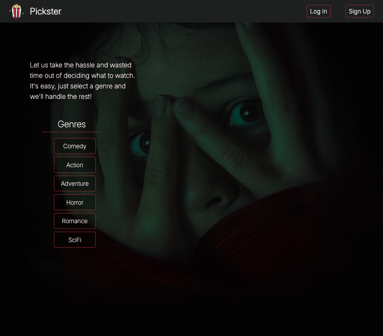
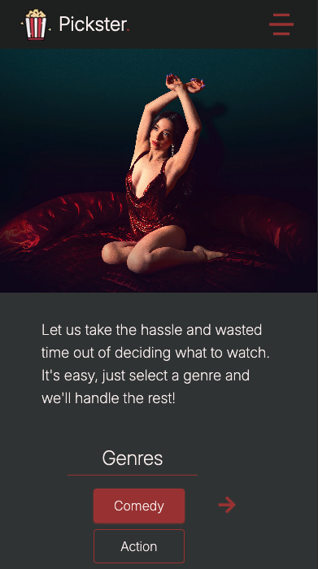
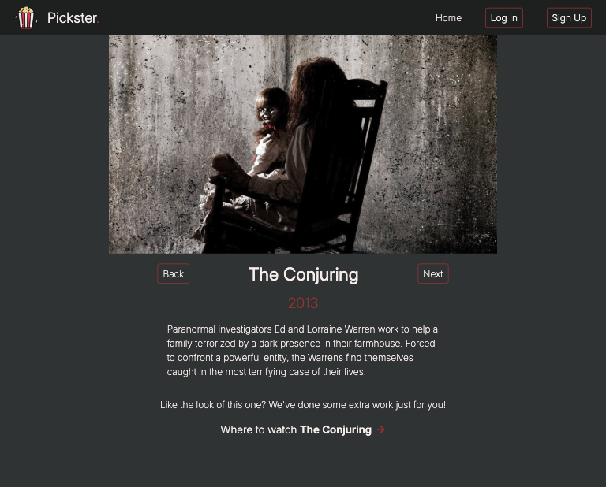
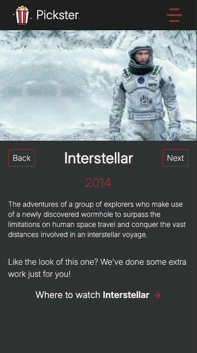
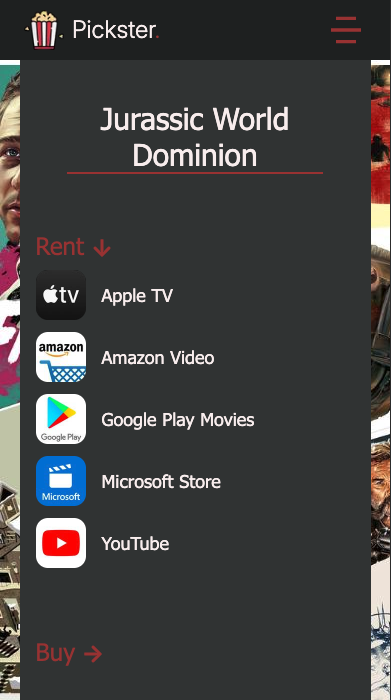

# Pickster Movies
- A dynamic web application built using Next.js, styled with TailwindCSS and integrated with The Movie Database's API

## Deployed Site: https://pickstermovies.vercel.app/

- Pickster Movies offers users a random movie to watch based on their preferred genre
- Once a movie has been chosen further information where it can be watched

## Screenshots

### Home - Desktop

### Home - Mobile

### Movie - Desktop

### Movie - Mobile

### Providers Page
